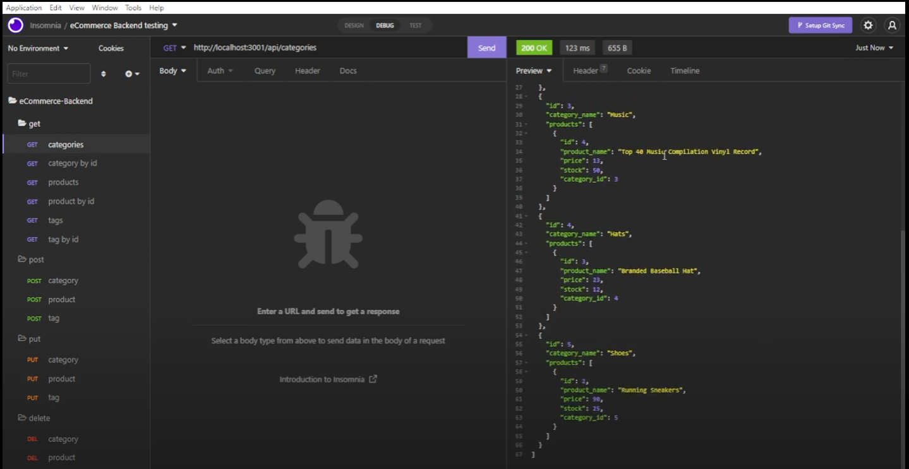

# eCommerce Back End

  

  #### Table of Contents
  
  1. [Description](#description)
  2. [Installation Instructions](#installation-instructions)
  3. [Usage Information](#usage-information)
  4. [Contributor Guidelines](#contributor-guidelines)
  5. [Test Instructions](#test-instructions)
  6. [License](#license)
  7. [Questions](#questions)
  
  ## Description
  * This program features backend code for an eCommerce website that enables the user to view, add, update, and delete categories, products, and tags. 
  
  ## Installation Instructions
  * In order to install this program, you must have node.js installed first. Download this repository and access it in your terminal of choice. When you are in the root folder enter "npm install" in the terminal to install all necessary packages. Be sure to fill out the env.EXAMPLE file and put your mySQL username and password, then rename the file to just ".env". In the terminal, log in to mySQL and type "source db/schema.sql;" to set up the ecommerce database. Then, in the terminal type "npm run seed" to add starting data. Afterwards, type "npm start" into the prompt to begin the program.

  * Watch the video on how to install this program and get it running [here](https://www.youtube.com/watch?v=En8c0hSWrPU)
  
  
  ## Usage
  * Use this program as a backend for your own eCommerce website.
  
  ## Contributor Guidelines
  * Currently, no contributions necessary.
  
  ## Test Instructions
  * No testing required.
  
  ## License
  * The application is covered under the following license:
    [mit](https://choosealicense.com/licenses/mit)
  
  ## Questions
  * Follow me on GitHub for updates and future projects at (http://github.com/jakekeebler)
  
  * If you have any questions on this project, email me at (jakekeebler@gmail.com)